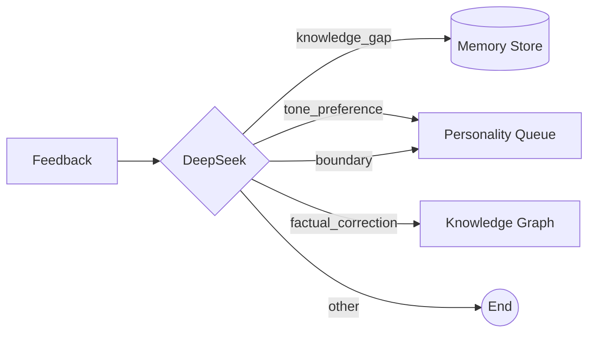

# Feedback Loop

## Overview

The feedback system captures user corrections and preferences, classifies them, and routes them to the appropriate subsystem. This closes the loop between user input and twin evolution.

## Three Feedback Modes

| Mode | Detection | Trigger | User Effort |
|------|-----------|---------|-------------|
| **Implicit** | Always-on keyword detection | User says "actually", "不对", "that's wrong" | None |
| **Lightweight** | Sampled ~20% | Thumbs-up/down buttons, optional text | Low |
| **Explicit** | User-initiated | "Correct this response" button | Full |

## Classification

All unclassified feedback is sent to DeepSeek with the assistant's original response for context.

### Categories

| Classification | Meaning | Routed To |
|---------------|---------|-----------|
| `factual_correction` | User corrected a factual error | Knowledge graph (planned) |
| `tone_preference` | User expressed how things should be said | Personality analysis queue |
| `knowledge_gap` | User provided new information | Memory store (creates MemoryEntry) |
| `boundary` | User set a topic/behavior limit | Personality analysis queue |
| `other` | None of the above | No routing |

## Routing



### Routing Details

- **knowledge_gap**: Immediately creates a `MemoryEntry` via `create_memory_entry()` with importance 0.5
- **tone_preference / boundary**: Sets `feedback.applied_to = ["personality_analysis"]` — these accumulate and are consumed by the personality analysis engine
- **factual_correction**: `applied_to = ["knowledge_graph"]` (knowledge graph integration pending)
- **other**: No action

## Integration Points

### Chat Flow
```
User message → Assistant response → Extract memories
                                        ↓
User correction → Classify → Route to subsystems
```

### Personality Analysis Trigger
```
Feedback(tone_preference, boundary)
    ↓ (accumulates)
POST /personality/analyze
    ↓
Collects feedback with applied_to=["personality_analysis"]
    ↓
DeepSeek analyzes patterns → creates proposal or auto-applies
```

### Feedback Submission
The `POST /api/v1/feedback` endpoint:
1. Stores the feedback entry
2. If no `classification` provided → calls `classify_and_route_feedback()`
3. Classification and routing happen in the same request

## Key Files

- `services/feedback/classifier.py` — Classification + routing logic
- `models/feedback.py` — FeedbackLog, PersonalityUpdateProposal models
- `api/feedback.py` — Route handlers

## Design Notes

- **Client-side classification**: If the frontend already provides a classification, the LLM call is skipped entirely
- **Error isolation**: Classification failures are caught silently — feedback is still stored
- **Accumulation model**: Personality-affecting feedback is not applied immediately — it waits for the analysis engine to process patterns
