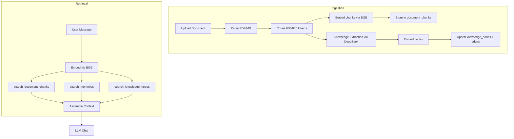

# RAG System

## Overview

Three-way parallel retrieval pipeline that augments chat responses with relevant context from three sources:

- **Document chunks** — semantic fragments of uploaded documents
- **Memories** — extracted long-term memories from past conversations
- **Knowledge graph nodes** — structured entities (skills, concepts, tools) extracted from documents

## Architecture



## Document Ingestion

Upload → Parse (PDF via pdfplumber / MD via mistune) → Chunk → Embed → Store

Triggered via `POST /api/v1/documents/upload`. After chunks are stored, a background task (`asyncio.create_task`) runs knowledge extraction — never blocks the upload response.

### Chunking Strategy

| Parameter | Value |
|-----------|-------|
| Target size | 600-800 tokens |
| Overlap | 100 tokens |
| Metadata | Original headings tracked per chunk |

## Knowledge Extraction (Phase A)

Runs asynchronously after document upload. Sends sampled chunks to DeepSeek with a structured prompt.

### Sampling Strategy

Max 30 chunks sent to LLM to control token cost:

- First 10 chunks (document intro/preamble)
- Last 5 chunks (conclusion/summary)
- 15 random chunks from the middle (deterministic seed based on first chunk content)

### LLM Prompt

- **System**: You are a knowledge graph extractor — identify key concepts, skills, tools, domains, and their relationships
- **User**: Document title, content type, sampled chunks, requested JSON format

### Output Example

```json
{
  "nodes": [
    {"label": "Kubernetes", "type": "tool", "description": "Container orchestration platform", "confidence": 0.95}
  ],
  "edges": [
    {"source": "Python", "target": "Machine Learning", "relation": "used_in", "weight": 0.8, "evidence": "Python is widely used in ML"}
  ]
}
```

### Deduplication

- Nodes matched by `label` → weighted average confidence, merged source_ids
- Edges matched by `(source_node_id, target_node_id, relation_type)` → averaged weight
- Node embeddings are also updated on merge

## Three-Way Retrieval

All three searches run in parallel via `asyncio.gather` with `return_exceptions=True` — a single source failure doesn't lose the entire context.

| Source | Function | top_k | min_similarity | Why threshold |
|--------|----------|-------|----------------|---------------|
| Document chunks | `search_document_chunks` | 8 | 0.65 | Chunks are verbose; high threshold keeps relevance strict |
| Memories | `search_memories` | 5 | 0.3 | Memories can be useful even at low similarity; threshold only filters noise |
| Knowledge nodes | `search_knowledge_nodes` | 5 | 0.5 | Node descriptions are short/abstract; lower than chunks but higher than memories |

## Context Assembly

Results are formatted into three sections and injected into the LLM system prompt:

```
=== RELEVANT MEMORIES ===
(content)

=== REFERENCED KNOWLEDGE ===
[heading1, heading2]
(chunk content)

=== KNOWLEDGE GRAPH ===
[concept] B+Tree (similarity: 0.84): A self-balancing tree data structure
[skill] Python (similarity: 0.72): Programming language
```

## Embedding Model

| Property | Value |
|----------|-------|
| Model | BAAI/bge-large-en-v1.5 |
| Dimension | 1024 |
| Precision | FP16 |
| Normalization | L2-normalized (cosine similarity = dot product) |
| Batch size | 32 |

## Vector Indexes

Created on application startup (idempotent `CREATE INDEX IF NOT EXISTS`):

| Table | Index Type | Column |
|-------|-----------|--------|
| `document_chunks` | IVFFlat (default) | embedding |
| `memory_entries` | IVFFlat (default) | embedding |
| `knowledge_nodes` | HNSW | embedding |

HNSW is used for `knowledge_nodes` because the table is smaller and query latency is more predictable.
